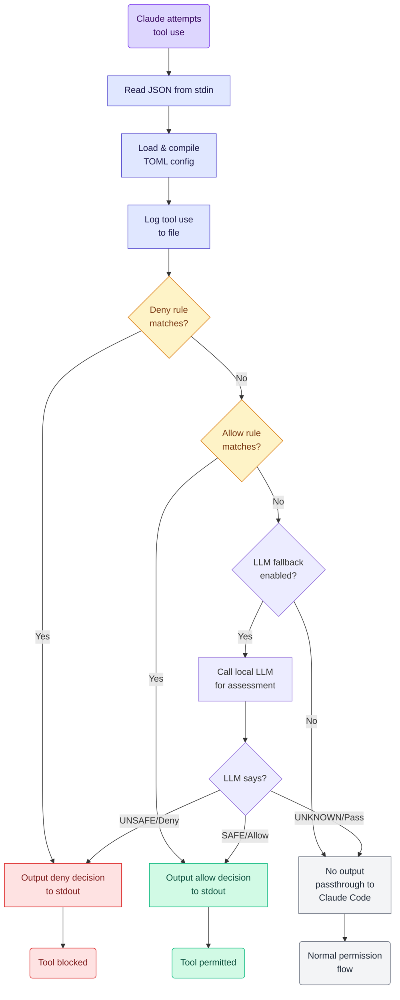

# Command Permissions Hook for Claude Code

A PreToolUse hook for Claude Code that provides granular control over which tools Claude can use, with support for allow/deny rules, pattern matching, and security exclusions.

NOTE this is largely a workaround of current (October 2025) limitations to how Claude Code does permissions - no amount of fiddling with [setting Bash permissions](https://docs.claude.com/en/docs/claude-code/iam#tool-specific-permission-rules) seems to work consistently - even for simple commands sometimes it prompts me over and over. So following their [Additional permission control with hooks](https://docs.claude.com/en/docs/claude-code/iam#additional-permission-control-with-hooks) guidelines, I thought I'd build a tool to help.

However this may well be a short-lived application; all the AI tools are moving very fast and I'm guessing Anthropic will improve these permissions soon. So I'm not packaging this up with a lot of help and guidance - use it if it helps, but you'll need to know how to build and run a rust application yourself, I'm afraid.

## Disclaimer

This has been largely "vibe coded" - I have checked all the code myself, but mostly just for flaws not for quality; I can't claim it is the best code out there! When time permits I might give it more love.

## Features

- All configuration is via a single `.toml` file - see [example.toml](./example.toml) for an example.
- You can allow tool/command combinations with specific regular-expression based filters
- You can also deny tool/command combinations similarly
- There is an extra "Allow X but not if Y matches" logic so you can keep regular expressions simpler for common cases
- **NEW: LLM Fallback Safety Assessment** - When no explicit rule matches, optionally consult a local LLM (via Ollama or other OpenAI-compatible endpoints) to assess safety
- Extensive logging is included - if you set logging to "verbose" it will log every PreToolUse call, very handy for diagnosing problems

## Installation

```bash
cargo build --release
```

The binary will be at `target/release/claude-code-permissions-hook`

## Configuration

Create a TOML configuration file (see `example.toml`):

```toml
[logging]
log_file = "/tmp/claude-tool-use.log"
# Log level: trace, debug, info, warn, error (default: info)
# - trace: logs every rule evaluation and match attempt
# - debug: logs rule matches and exclude skips
# - info: logs allow/deny decisions only
# - warn/error: minimal logging
log_level = "info"

# Allow rules - checked after deny rules
[[allow]]
tool = "Read"
file_path_regex = "^/Users/korny/Dropbox/prj/.*"
file_path_exclude_regex = "\\.\\."  # Block path traversal

[[allow]]
tool = "Bash"
command_regex = "^cargo (build|test|check|clippy|fmt|run)"
command_exclude_regex = "&|;|\\||`|\\$\\("  # Block shell injection

[[allow]]
tool = "Task"
subagent_type = "codebase-analyzer"

# Deny rules - checked first (take precedence)
[[deny]]
tool = "Bash"
command_regex = "^rm .*-rf"

[[deny]]
tool = "Read"
file_path_regex = "\\.(env|secret)$"

# Optional: LLM Fallback (consult local LLM if no rule matches)
[llm_fallback]
enabled = false
endpoint = "http://localhost:11434/v1"  # Ollama default
model = "llama3.2:3b"
timeout_secs = 5

[llm_fallback.actions]
on_safe = "allow"
on_unsafe = "deny"
on_unknown = "pass_through"
```

## LLM Fallback Setup (Optional)

The LLM fallback feature allows the hook to consult a local language model when no explicit allow/deny rule matches. This provides intelligent safety assessment without requiring exhaustive rule definitions.

### Prerequisites

1. **Install Ollama** (if not already installed):
   ```bash
   curl -fsSL https://ollama.com/install.sh | sh
   ```

2. **Pull a model** (recommended: small, fast models):
   ```bash
   # Lightweight option (3B parameters, ~2GB)
   ollama pull llama3.2:3b
   
   # Alternative lightweight models:
   ollama pull phi3:mini        # Microsoft Phi-3 (3.8B)
   ollama pull mistral:7b       # Mistral 7B
   ```

3. **Verify Ollama is running**:
   ```bash
   ollama list
   # Should show your downloaded models
   ```

### Configuration

Enable LLM fallback in your TOML config:

```toml
[llm_fallback]
enabled = true
endpoint = "http://localhost:11434/v1"
model = "llama3.2:3b"  # Use the model you pulled
timeout_secs = 5
temperature = 0.1  # Low for consistent classification

[llm_fallback.actions]
on_safe = "allow"          # Allow operations classified as safe
on_unsafe = "deny"         # Block operations classified as unsafe  
on_unknown = "pass_through" # Defer to Claude Code for uncertain cases
on_timeout = "pass_through" # What to do if LLM doesn't respond in time
on_error = "pass_through"   # What to do if LLM errors out
```

### How LLM Assessment Works

1. Hook receives tool use request with no matching rule
2. Sends tool name and parameters to local LLM with classification prompt
3. LLM responds with:
   - **SAFE**: Read-only operations, standard dev commands (cargo, git, npm)
   - **UNSAFE**: Destructive operations (rm -rf, writes to /etc, shell injection patterns)
   - **UNKNOWN**: Cannot determine with confidence
4. Hook applies configured action policy (allow/deny/pass_through) based on classification
5. Decision is logged to the log file for review

### Benefits

- **Intelligent defaults**: No need to write rules for every tool/command
- **Privacy-preserving**: Runs entirely locally (no data sent to external APIs)
- **Fast**: Small models like llama3.2:3b respond in <1 second
- **Graceful degradation**: Timeouts and errors fall back to normal Claude Code flow

### Testing LLM Fallback

Create a test config with LLM enabled but minimal rules:

```bash
# Create test config
cat > test-llm-config.toml << 'EOF'
[logging]
log_file = "/tmp/claude-llm-test.log"
log_level = "debug"

[llm_fallback]
enabled = true
endpoint = "http://localhost:11434/v1"
model = "llama3.2:3b"
timeout_secs = 5

[llm_fallback.actions]
on_safe = "allow"
on_unsafe = "deny"
on_unknown = "pass_through"
EOF

# Test with a safe operation (should allow)
cat tests/test_safe_read.json | cargo run -- run --config test-llm-config.toml

# Check the log to see LLM reasoning
tail -1 /tmp/claude-llm-test.log | jq
```

## Claude Code Setup

Add to `.claude/settings.json`:

```json
{
  "hooks": {
    "PreToolUse": [
      {
        "matcher": "*",
        "hooks": [
          {
            "type": "command",
            "command": "/path/to/claude-code-permissions-hook run --config ~/.config/claude-code-permissions-hook.toml"
          }
        ]
      }
    ]
  }
}
```

## Usage

### Validate Configuration

```bash
cargo run -- validate --config example.toml
```

### Run as Hook (reads JSON from stdin)

```bash
echo '<hook-input-json>' | cargo run -- run --config example.toml
```

### Test Cases

See `tests/` directory for sample inputs:

```bash
# Test allowed Read
cat tests/read_allowed.json | cargo run -- run --config example.toml

# Test denied path traversal
cat tests/read_path_traversal.json | cargo run -- run --config example.toml

# Test allowed Bash command
cat tests/bash_allowed.json | cargo run -- run --config example.toml

# Test unknown tool (passthrough - no output)
cat tests/unknown_tool.json | cargo run -- run --config example.toml
```

## How It Works



### Flow Description

1. **Load Configuration**: Parse TOML and compile all regex patterns
2. **Read Hook Input**: Parse JSON from stdin containing tool name and parameters
3. **Log Tool Use**: Write to log file (non-fatal, won't block on errors)
4. **Check Deny Rules**: If any deny rule matches, output deny decision
5. **Check Allow Rules**: If any allow rule matches, output allow decision
6. **LLM Fallback** (optional): If enabled and no rule matched, consult local LLM
   - Sends tool info to LLM for safety classification (SAFE/UNSAFE/UNKNOWN)
   - Applies configured action policy based on LLM response
   - Handles timeouts and errors gracefully
7. **No Match**: Exit with no output (normal Claude Code permission flow)

### Rule Matching Logic

For each rule:
1. Check if tool name matches
2. Extract relevant field from tool_input (file_path, command, subagent_type, or prompt)
3. Check if main regex matches
4. If yes, check that exclude regex doesn't match
5. First match wins (deny rules checked first)

### Supported Tools

- **Read/Write/Edit/Glob**: Match on `file_path`
- **Bash**: Match on `command`
- **Task**: Match on `subagent_type` or `prompt`

## Security Patterns

### Path Traversal Prevention
```toml
[[allow]]
tool = "Read"
file_path_regex = "^/safe/directory/.*"
file_path_exclude_regex = "\\.\\."  # Block ../
```

### Shell Injection Prevention
```toml
[[allow]]
tool = "Bash"
command_regex = "^(cargo|git|npm) "
command_exclude_regex = "&|;|\\||`|\\$\\("  # Block shell metacharacters
```

### Sensitive File Protection
```toml
[[deny]]
tool = "Read"
file_path_regex = "\\.(env|secret|key)$"
```

## Development

### Run Tests
```bash
cargo test
```

### Check Code
```bash
cargo clippy
cargo fmt
```

### Logging

Set `log_level` in the TOML config file (trace, debug, info, warn, error). Defaults to "info". Can be overridden with `RUST_LOG` environment variable for testing.

## Log Format

Logs are written in JSON format, one entry per line:

```json
{"timestamp":"2025-10-06T10:27:59Z","session_id":"abc123","tool_name":"Read","tool_input":{...},"cwd":"/path"}
```

## License

See LICENSE file for details.
